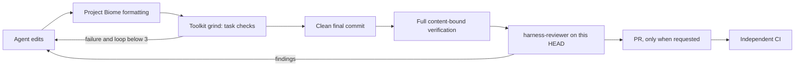

# Harness Toolkit pilot

This repository uses Harness Toolkit as optional, project-local development infrastructure. The pilot raises the chance that an agent finishes the intended work and produces evidence tied to the exact repository state. It does not change the scanner, its public API, its score, or its zero-runtime-dependency contract.

The pinned reference is the Toolkit branch `feature/add-providers` at commit `87a7565546bf5764cb8710319d110cfa59b4c732`. Its manifest currently reports package version `0.10.6`; branch and commit, rather than that development version, are the source of truth. Setup needs Node 24 or newer and Bun because the branch builds its runtime bundles with Bun. The published scanner continues to support Node 18 or newer.



## Isolation and ownership

`npm run harness:setup` installs the exact upstream commit under `.cache/harness-toolkit/`, builds and materializes its runtime there, and generates provider wiring in isolated config directories. It then merges portable project launchers into `.cursor/hooks.json`, `.claude/settings.json`, and `.codex/hooks.json`. The setup also isolates the branch's VS Code/Copilot destination, snapshots the relevant global Cursor, Claude, Codex, Copilot and TLC paths before and after installation, and refuses activation if any changed. It does not add a package dependency, update the global `PATH`, or install global hooks.

The versioned policy is `.tlc/harness/config.json`. Runtime, state, logs, lessons, evaluation records and verification evidence are ignored. Every hook invokes `scripts/harness/hook.mjs`, which supplies the isolated environment explicitly. An enabled pilot with a missing runtime reports `HARNESS DEGRADED` and denies acting events; it cannot silently count the toolkit as operational.

The project's existing controls remain authoritative:

| Control | Responsibility |
| --- | --- |
| `guard-shell.js` | Project-specific destructive-command policy, including npm publication and hard reset. |
| `format-on-edit.js` | Advisory formatting with the repository-pinned Biome binary; it never downloads a formatter. |
| Harness Toolkit | Session context, grind feedback, policy gates, lessons, observations and review evidence across Cursor, Claude Code and Codex. |
| Husky | Exact-content test gate before commit and full delivery gate before push, including work outside an editor. |
| CI | Re-runs repository checks on the pushed commit in a separate environment. |

No hook depends on another hook's order. Formatting is advisory, lint is decisive, Git gates cover non-editor work, and CI does not trust local evidence.

## Commands

Run setup only in this repository worktree:

```powershell
npm run harness:setup
npm run harness:status
npm run test:harness:integration
```

Use `npm run harness:toolkit -- <command>` instead of a global `tlc` command. This is deliberate: the relocated installation has no global CLI link. On Windows, `doctor` currently reports that missing link and the two valid isolated `harness-init` links as three failures; these are known diagnostics of the isolation model. It also reports the captured VS Code hook as not user-wired, which is intentional while the provider remains preview-only here. `harness:status` is the authoritative local health check: it validates runtime files, branch provenance and unchanged global configuration. Integration tests exercise the real hook entrypoints instead of treating diagnostic rows as proof.

Codex loads the project hook layer only after trust review. After setup, restart the Codex project session, open `/hooks`, review `.codex/hooks.json`, and trust its current hash. Any hook change requires review again. The current session cannot retroactively load hooks written after it started.

The upstream feature-branch adapter currently treats the hook payload's `cwd` as the project root. Because Codex can start a session from a repository subdirectory, the project wrapper anchors that field to the Git root before invoking Toolkit and retains the reported directory as `tlc_original_cwd`. This keeps policy, lessons and presence state in the repository-level `.tlc/` directory.

Verification commands are proportional:

```powershell
npm run harness:verify -- test
npm run harness:verify -- docs
npm run harness:verify -- commit
npm run harness:verify -- full --fresh
npm run harness:verify -- ready
```

The full gate runs canonical tests, lint, coverage, consumer type checking, published-export checking, documentation, generated-plugin synchronization and the L4 scanner. When the pilot is active, it also runs the real toolkit integration tests. It always rejects any scanner runtime dependency. Results record the HEAD, a SHA-256 fingerprint of all tracked and untracked nonignored input files, exact argv, exit codes and durations. Any edit, deletion, config change, Node change, activation change or new commit invalidates reuse. Timeouts, partial runs and command failures write `fail`, never `pass`.

`release:prepare` is intentionally absent because it changes versions. PR creation and `gh pr ready` are recognized in native, `rtk`, and `rtk proxy` forms. The launcher requires a clean worktree and matching full evidence; operator rules additionally require an observed `harness-reviewer` run for the current HEAD. Neither gate grants permission to open, merge or publish.

## Reviewer contract

Cursor, Claude Code and Codex receive a read-only `harness-reviewer`; the Codex definition is `.codex/agents/harness-reviewer.toml`. Give it the objective, base commit, final HEAD, full diff and verification evidence. It must report the reviewed HEAD, findings ordered by severity, affected contracts, inspected evidence, limitations and an approve/request-changes verdict. If it finds a problem, change the code, commit, verify and review the new HEAD again.

The observation proves that the reviewer ran. It does not prove that its judgment is correct. Deterministic checks and CI remain separate sources of evidence.

## Policy choices

The project policy enables grind with three loops and no automatic file attachment; failure feedback and classification; progressive handoff/context; autopilot; lessons with enough session budget for the shipped core corrections; plan, supply-chain, documentation and operator rules; framed external content; and local observability without payloads for 14 days.

Comment enforcement remains observational. Duplication checks are disabled because generated plugin content and deliberate monorepo repetition would add noise. Model allowlists, Fast blocking, repeated-command blocking, idle-turn blocking, budget continuation, global spool, ship claims and empty-diff anti-ship are disabled. Delivery relies on content-bound checks and review evidence instead of textual PASS markers.

For implementation work, state `HARNESS_PLAN: <paths>` before editing. If scope changes, state `HARNESS_PLAN_DEVIATION: <path> — <reason>` so the deviation is explicit and reviewable.

## Acceptance evaluation

Run the same objective and model with and without the toolkit for six scenarios in each host: simple edit, tested fix, documentation, generated plugin, configuration/dependency and review-required change. Record duration, human interventions, pre-delivery failures caught, false blocks, retries, check time and injected context size:

```powershell
npm run harness:evaluate -- record --runId run-01 --provider claude --mode toolkit --scenario tested-fix --model model-name --objective objective-id --durationMs 120000 --interventions 1 --failuresDetected 1 --falseBlocks 0 --retries 1 --checkMs 30000 --contextChars 900
npm run harness:evaluate -- report
```

Promotion requires all 36 provider/mode/scenario records, no protection regression, no writes outside the listed destinations, every seeded critical failure caught before delivery, no ready PR with missing/stale evidence, no unbounded loop, median overhead of at most 20% for already-passing simple work, and evidence of reduced intervention or successful correction in failing scenarios. Cursor, Claude Code and Codex are promoted independently. A synthetic entrypoint test does not substitute for a real host session.

## Disable, recover and update

`npm run harness:disable` removes only toolkit launchers from the three project hook documents. It preserves project guards, formatter hooks, runtime and evidence for diagnosis. Running setup again is idempotent.

Before updating, fetch `feature/add-providers`, inspect the commits and hook/config changes since `SOURCE_COMMIT`, then update `SOURCE_COMMIT`, `VERSION`, and the schema URL together. Run setup twice, run unit and integration tests, exercise one real session per host, and repeat the full verification. Promote the new commit only after every host meets its own acceptance criteria.

The design shifts memory and repetition away from the developer: the human chooses the goal and trade-offs; the implementing agent changes the repository; deterministic tools verify concrete properties; an independent agent challenges the reasoning; CI verifies the delivered commit. The remaining human work is judgment about product value, adequacy of the criteria and acceptable cost.
